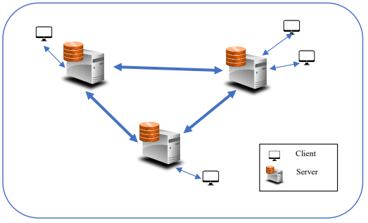
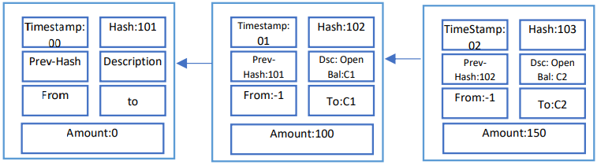

# Background Information

## Video Example

https://youtu.be/vDJA6MLTDLs

## Description

Imitation of DApp (Decentralized Apps) e-commerce system that uses
blockchain as a data structure for its ledger. Three decentralized servers
are used for blockchain purposes. In this case, customers decide to transfer
the money to each other from any random server. Then servers send its workload 
to the wealthiest server to increase/decrease the budget. Blockchain is used
to verify whether the data is correct and untempered. Then the server is rewarded
with additional coin that increases its wealth, meanwhile all other servers are
notified about the transaction and wealth increase. 

To ensure that users are able to make a transaction at any time, system stays on
at all times if all the servers are running. Since the data is shared among the servers,
it is unnecessary for a central database, which in turn increases the up-time. All
the transactions need to be recorded and saved in .xlsx (Excel sheets).

# System Characteristics

- No central authority (centralized DB)
- System consists of a network of N servers (3 as an example)
- Internet connection is preset between each server
- System fails if all servers go down only. The system continues to serve clients even if N-1 servers fail
- The client's request might arrive to any server
- The database is mirrored on all the servers (i.e. blockchain or the list of transactions)
- Any server knows the wealth of other servers in the internet

# System Architecture 


- Must have at least 3 servers: http://localhost:3000/, http://localhost:3001/, http://localhost:3002/
- Client can access any of them to commence a new transaction
- Client's page must contain four input fields:

    1. From
    2. To
    3. Amount
    4. Description

- Client's page must contain transaction status
- JSON format must be used for data transfer
- Server receiving a request needs to find which server is going to validate the new transaction (i.e. the wealthiest server)

  - "Proof of stake" algorithm is used to select randomly with proportional to the steak (wealth). Where wealth is an integer number in this case.

- Validator has to do the following:

  - Check clients balance.
  - Approve/reject it. 
  
    - If approved, notify all other servers in the network to add a new block to the blockchain for the transaction and update the wealth of the validator
    - If disapproved, then network is informed.

  - Status: approved/rejected should be updated to notify the customer.

- Chosen server that has successfully validated the process will receive 3 coins to increase its wealth.
- Transactions need to be recorded and saved in .xlsx (Excel sheet)

# Testing Scenario

- Assume that the balance of each client is the following (can be changed in the ```./shared_files/bank```):

    - C1 = 100$
    - C2 = 150$

- Assume that the wealth of each server is the following (can be changed in the ```./shared_files/serverWealth.js```):

    - S1 = 1
    - S2 = 3
    - S3 = 5

- Now, these clients have the same blockchain that consists of three blocks
  (depicted below), the genesis block and the open balance block of both clients.
  

# Scenario (works with the code)

- C1 sends 20$ to C2 via a transaction to S2 with details:

  - From: C1
  - To: C2
  - Amount: 20$
  - Description: cost of service

- The transaction must be validated. 
- Since S2 has a wealth of each server, it knows that S3 is the wealthiest, so it sends the transaction to S3
- S3 receives it, loops through all the blocks in the chain to identify C1's balance
- Since C1 has enough balance, it creates a new block, attaches it to the existing chain, increases its wealth and notifies all other servers about it.

## Libraries Used

1. "crypto-js": "^3.1.9-1"
2. "exceljs": "^1.4.2"
3. "express": "^4.16.3"
4. "nodemon": "^1.17.3"
5. "npm": "^6.0.0"
6. "object-sizeof": "^1.2.0"
7. "protocol-buffers": "^4.0.4"
8. "socket.io": "^1.7.1"
9. "socket.io-client": "^1.7.1"

## Installation

1. Run ```npm install``` in each server

   - ./server1
   - ./server2
   - ./server3

2. To change Client's bank accounts or server wealth refer to the following files:

   - ```./shared_files/bank.js```
   - ```./shared_files/serverWealth.js```

3. To run JSON (using JSON to transfer data):

   1. Run ```node server-1-JSON.js``` in the ```./server1``` folder
   2. Run ```node server-2-JSON.js``` in the ```./server2``` folder
   3. Run ```node server-3-JSON.js``` in the ```./server3``` folder

OR 

3. To run BUF (using BUF to transfer data):

    1. Run ```node server-1-BUF.js``` in the ```./server1``` folder
    2. Run ```node server-2-BUF.js``` in the ```./server2``` folder
    3. Run ```node server-3-BUF.js``` in the ```./server3``` folder

4. Access each server via the following URLS:

   1. http://localhost:3000
   2. http://localhost:3001
   3. http://localhost:3002

